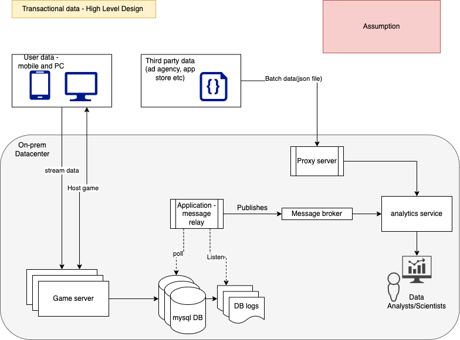
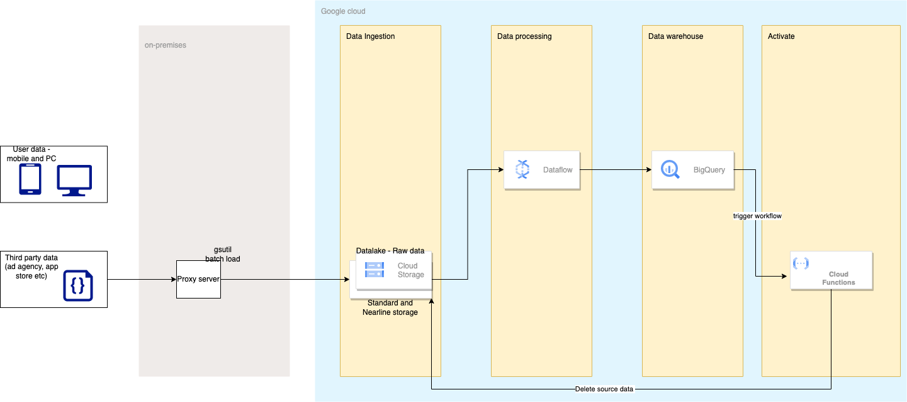
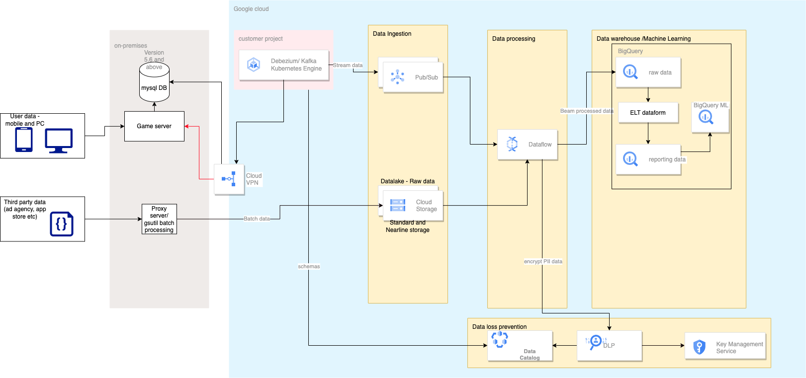
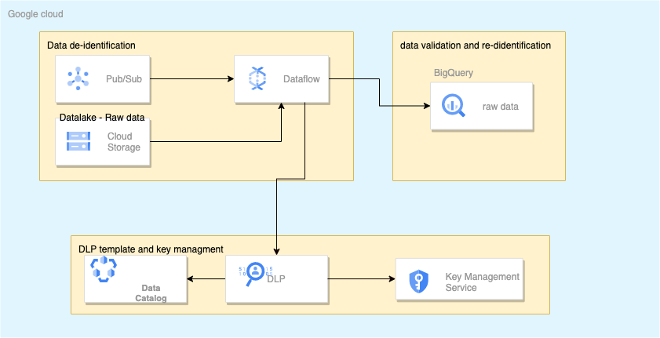
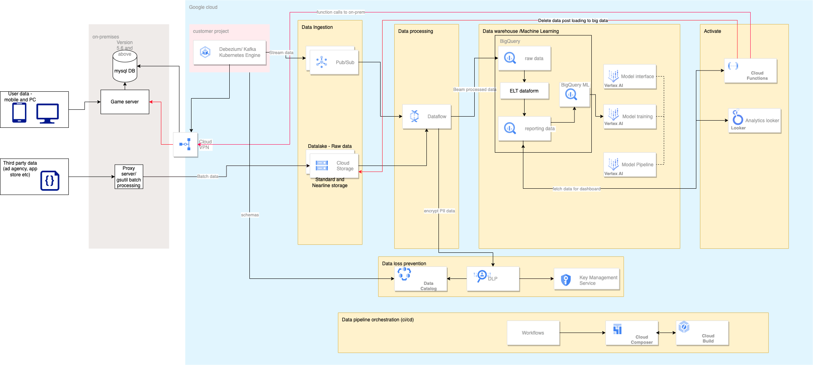
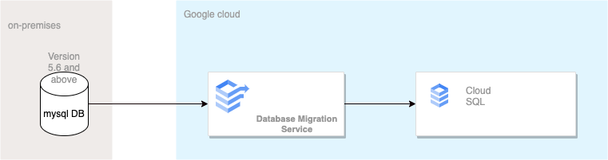
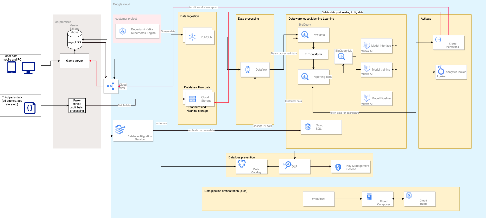
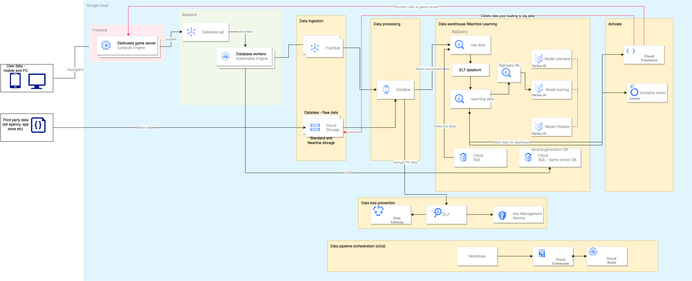
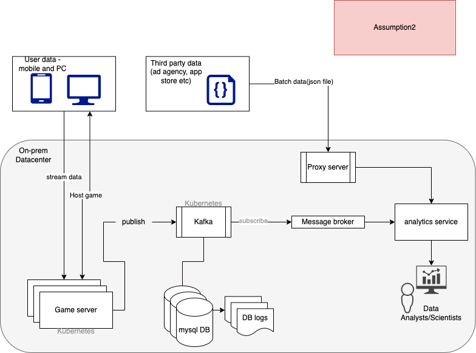
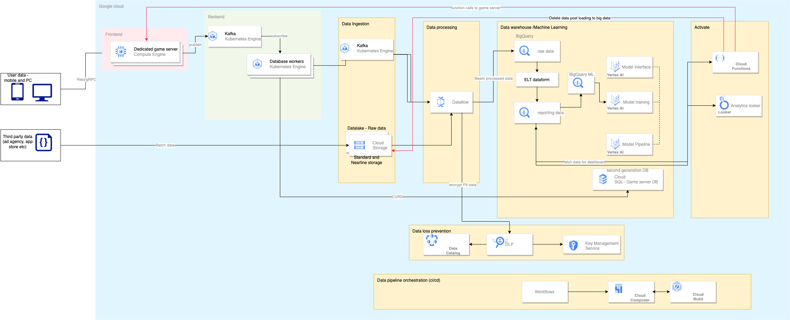

## Problem context
Suppose we are a video game company that distributes several games on different
terminals (both PCs and consoles). Each terminal sends daily and in real time multiple
events related to the current game of a player for each of the games he owns (for
example the player has unlocked a trophy following the success on a level, the number of
times that a player dies in facing the boss, the movements of the player's character on
the map, etc.).

## Functions
* Provide a comprehensive architecture of such a system on Google Cloud Platform
which covers the entire workflow (data collection and reception, ingestion and storage,
restitution to Data Analysts and Data Scientists), as well as all the necessary modules
needed for its maintenance (monitoring, etc ...). 
* The data storage architecture is currently on an on-premise MYSQL system containing TB of data (Data Analysts are very
satisfied)
* You will need to plan for the transition to new workflow.

## Goals for design review
* Low latency (low event latency): The data made available to Data Analysts (at least)
and Scientists (at most) must be as recent as possible, and in the most interactive and
fast way possible (for Analysts).
* Scalability: The system must be scalable and offer the possibility of storing a large
volume of data, but also of restoring it on demand as quickly as possible.
* Versioning: In case the system or the types of events to be collected are evolving, it
would be necessary to think about the versioning of the system in order to plan rollbacks
if any bug occurs, to test new features before going into production, etc.…
* Deployment: Workflow deployment must be fully automated from A to Z, making it
possible to secure actions.
* Monitoring: It should be possible to easily monitor the system, to see if data relating to
a particular event or region is no longer received, or even to provide an alerting system
according to the types of errors reported.
* Tests: How to perform unit and integration tests on such a system?
* FinOps: How to monitor system costs and their optimization? The added monthly data is
around + 10 TB, how do you manage the costs? What can you suggest?
* Visualization: What tool do you offer for visualizing and presenting data in the form of
graphs?
* Security: How to proceed in case of an inadvertent deletion of the data?
* Incident: A data analyst reports that the data is missing over several days, how do you
identify and resolve the problem? What tools do you use? What are the different stages?

## Assumption1
### Existing architecture workflow
Batch Data: Could be in form of file (json,csv) or any other log file sent by third party service to video game company. Example number of downloads from loging site, ad agency sending ad streaming reports and payment gateway sending daily transcation details. This data is directly sent to data analytics system for processing unstructured data. 

Transactional Data: Application data stored in RDBMS (relational data) collected from PC and console. Example player login, player has unlocked a trophy following the success on a level, the number of times that a player dies in facing the boss, the movements of the player's character on the map, player purchase coins and other addons. This data is inserted to mysql table which is closely monitored by a process called a message relay. Message relay listens for changes in the outbox table and whenever a change is detected by this process, it publishes this event to a message broker and passed to data analytics system.

## Solution Architecture

#### Decision Statement
Migrate existing workflow to google cloud in phases. 

#### Decision 
Migration will be broken down to multiple phases given below.
* Phase1-A : Migrate live data stream workflow.
    * First part of this migration address business goals for live data stream workflow and analytics in google cloud. 
* Phase1-B : Migrate historical data.
    * Second part of this migration addressess business goals for historical data analytics in google cloud.
* Phase2: Migrate gameserver. *( Not discussed further )*
    * Final part of the migration includes migration of game server frontend and backend to google cloud and plug into existing workflow for analytics.

#### Motivation
* Trickle migration method allows us to run old system in parallel which eliminates downtime or operational interruptions. Processes running in real-time can keep data continuously migrating.
* Team is currently satisfied onprem mysql latency. 
* Historical data can still be accessed via old system.
* Gives opportunity to test and optimize workflows before migrating large amount of historical data. 

#### Alternatives
* Big Bang migration, full transfer is completed within a limited window of time. Live systems experience downtime while data goes through ETL processing and transitions to the new database. The pressure, though, can be intense, as the business operates with one of its resources offline. This risks a compromised implementation.

#### Implications
* Historical data will not be available untill Phase1-B migration completes. 

## Migrate live data stream workflow.
### Data Ingest
Data ingest layer takes live stream data and batch data from on-prem env. 

#### Batch data
Batch data could be in form of file (json,csv) or any other log file sent by third party service to video game company. These files located in onprem proxy server can be migrated to cloud storage using custom scripts or gsutil.
#### Decision
Cloud storage will be used to store batch data from onprem. Combination of different storage class can be used for different types of batch data. Standard storage is best for data that is frequently accessed ("hot" data) and/or stored for only brief periods of time. Nearline storage is a low-cost, highly durable storage service for storing infrequently accessed data.
#### Motivation
* Cloud Storage is a managed service for storing unstructured data in object storage.
* Combination of storage class helps to keep storage cost down.
* Scalability and Capacity management, Unlimited storage with unlimited access, scales automatically based on usage. 
* Availability, All Cloud Storage data is redundant across at least two zones within at least one geographic place as soon as you upload it. Regional bucket would have following sla for standard and nearline storate data. 
Standard storage data -   99.99% in regions
Nearline storage data -   99.9% in regions
RTO=0: automated failover and failback on zonal failure (no need to change storage paths)
* Regional buckets have lowest storage price and meets SLA's. ( assumption )
* Durablity, High durability (99.999999999% annual durability) for all class.
* Security, Offering fine-grained access controls and end-to-end encryption.
* Monitoring/Alerting ( explained in detail later )
    * Default cloud storage monitoring covers server error rate, client error rate, read errors, write errors, data ingress rate and egree rate over the network etc 
    * Default metrics available helps to troubleshoot faults easily, get intelligent alerts and analyze historical data aggregated over a period.
#### Future case
Buckets can be created in different region closer to source thus reducing latency in transfering large files. Applicable in phase2 migration when third party service is directly able to push data into gcs. 

#### Stream data

Application data stored in RDBMS (relational data) collected from PC and console. Example player login, player has unlocked a trophy following the success on a level, the number of times that a player dies in facing the boss, the movements of the player's character on the map, player purchase coins and other addons. This data is inserted to onprem mysql table, CDC provides a representation of data that has changed in a stream, allowing computations and processing to focus specifically on changed records.

[Solution](https://cloud.google.com/blog/products/data-analytics/how-to-move-data-from-mysql-to-BigQuery), works with any MySQL database, which is monitored by a connector we developed based on Debezium. The connector stores table metadata using Data Catalog (Google Cloud’s scalable metadata management service) and pushes updates to Pub/Sub (Google Cloud-native stream ingestion and messaging technology). A Dataflow pipeline then takes those updates from Pub/Sub and syncs the MySQL database with a BigQuery dataset.

#### Decision
CDC pipelines with google pub/sub will be created to take data from onprem mysql. Debezium connector will be deployed on google kubernetes platform (GKE).
#### Assumptions
* Mysql on prem db version 5.6 or above.
#### Motivation
* CDC Debezium, an excellent open source project for change data capture. Datafolow templates readily available and updated regularly.
* CDC Debezium solution is coded to work with pub/sub.
* Dead letter topics. Dead letter topics allow for messages unable to be processed by subscriber applications to be put aside for offline examination and debugging so that other messages can be processed without delay.
* Capacity, Pub/sub is fully managed service designed to be highly reliable and scalable. Pub/Sub scales automatically. Capacity for message publishing is automatically provisioned, so you can send and receive message at any rate, up to the quotas you configure for project.
* Availability, Cross-zone message replication and per-message receipt tracking ensures at-least-once delivery at any scale.
* GDPR (Data residency) compliant  - Pub/Sub service can store messages in allowed by a topic storage policy. Pub/Sub topics replicate data to three zones within a region. 
* Security, Pub/Sub is a HIPAA-compliant service, offering fine-grained access controls and end-to-end encryption.
* Monitoring/Alerting ( explained in detail later )
You can use the monitoring dashboards provided within Pub/Sub. 
	- Monitor delivery latency health
	- Monitor and alert quota breach (create alert policies using monitoring api)
	- Monitor message backlog, delivery latency health to check over all latency 
#### Future case
  * Applicable in phase2, On migrating gameserver infrastructure in gcp. Pub/sub can can directly plug with GKE hosted game server to consume stream events. ( Assumption )
  * Based on the source of request regional endpoints route traffic to closest geographical region.
  * Third party intergration, Confluent Cloud for Apache Kafka can be deployed to offer freedom from vendor lock-it. This is relevant when game server frontend and backend are migrated to gcp. 
#### Alternatives
* Pub/Sub Lite is a cost-effective solution that trades off operational workload, availability, and features for cost efficiency. Pub/Sub Lite requires you to manually reserve and manage resource capacity. Within Pub/Sub Lite, you can choose either zonal or regional Lite topics. Regional Lite topics offer the same availability SLA as Pub/Sub topics. However, there are reliability differences between the Pub/Sub and Pub/Sub lite in terms of message replication.
    * Pub/Sub scales automatically. Capacity for message publishing is automatically provisioned, so you can send and receive message at any rate, up to the quotas you configure for project. Pub/Sub Lite is manually provisioned. You must configure the number of partitions per Lite topic. You must also provision storage and throughput capacity. 
    * Pub/Sub supports multiple message delivery modes. These include Pull (traditional polling), Push (HTTPS POST), StreamingPull (bidirectional RPC, for lowest latency and highest efficiency), and pull over HTTP REST and gRPC. Pub/Sub Lite only supports streaming gRPC pull message delivery. To request messages, subscribers establish bidirectional streaming connections with each partition.
    * Pub/Sub uses per-message parallelism. This enables concurrent processing of any number of messages, from one or thousands of clients for a single subscription. Pub/Sub Lite uses partition-based parallelism. This forces a client to process each data partition in linear order on a single client instance. This limits the maximum number of client instances to at most the number of partitions.
    * Replication Pub/Sub topics replicate data to three zones within a region. Regional Pub/Sub Lite topics replicate data to two zones within a region. Zonal Pub/Sub Lite topics store data in a single zone within a region.
* Confluent Cloud for Apache Kafka Managed Services is availble through third party intergration in market place. 
    * Can be deployed to offer freedom from vendor lock-it. 
    * Existing kafka code on onpremises system can be resued with minimum change. 
    * Useful for hybrid deployments across public/private clouds. 
    * This is relevant for future case when game server frontend and backend are migrated to gcp. 

### Data Processing

A Data processing workflow is a complex process that has both batch and stream data ingestion pipelines. The processing is complex and multiple tools and services are used to transform the data into warehousing and an AL/ML access point for further processing. 
#### Assumptions
* Streaming and batch data processing required.
#### Decision 
Cloud Dataflow will be used to load the data into the target BigQuery and an AL/ML access point for further processing. Cloud Dataflow is a unified stream and batch processing engine that leverages Apache Beam as its SDK, enabling organizations to build processing pipelines with the languages they choose.e. Apache Beam also offers freedom from lock-in, as code written to Beam can be executed on Dataflow, Apache Spark, Apache Flink, and other “runners.” Using the same code for batch and stream reduces both costs and complexity; the latter is especially important in light of the skills shortages in data analytics, AI/ML, and infrastructure mentioned previously. Dataflow ensures “exactly once” processing (eliminating both duplication and missed inputs) with fault-tolerant execution.
#### Motivation
* Cloud Dataflow is managed serverless solution which does apply automatic scaling, but won’t scale to zero instances when there is no incoming data.
* Dataflow automatically manages performance, scale, availability, security, and compliance. It offers both administrative and cost efficiency, supporting parallel data processing and charging customers only for what they consume.
* Dataflow tracks small data bits and assigns them to processing nodes with a focus on workflow scheduling and dynamic rebalancing. This is particularly helpful for stream data, which often comes in peaks and valleys. Dataflow will automatically add new workers and assign data to them if that will improve execution time, and spin down workers when the volume subsides. As shards take longer to process and begin to affect worker execution time, Dataflow will reallocate load from the struggling workers to others.
* Capacity, 
    * Dataflow is a fully managed serverless solution that applies automatic scaling, but won’t scale to zero instances when there is no incoming data. 
    * Flexible Resource Scheduling (FlexRS) Can be used for batch job that do not run frequently. Dataflow FlexRS reduces batch processing costs by using advanced scheduling techniques, the Dataflow Shuffle service, and a combination of preemptible virtual machine (VM) instances and regular VMs.
* Availability and Scalability,
    * Dataflow is a serverless solution that can vertical and horizontally autoscale. Vertical scaling - Dynamically adjusts the compute capacity allocated to each worker based on utilization. Vertical autoscaling works hand in hand with horizontal autoscaling to seamlessly scale workers to best fit the needs of the pipeline.
    * Horizontal autoscaling - Horizontal autoscaling lets the Dataflow service automatically choose the appropriate number of worker instances required to run job. The Dataflow service may also dynamically reallocate more workers or fewer workers during runtime to account for the characteristics of job.   
* Security, 
    * A customer-managed encryption key (CMEK) enables encryption of data at rest with a key that you can control through Cloud KMS. You can create a batch or streaming pipeline that is protected with a CMEK, and you can access CMEK-protected data in sources and sinks.
    * Workflows when manged via cloud composer.
    * The IAM permissions for Google Cloud project control access to the Dataflow service. Any principals who are given editor or owner rights to project can submit pipelines to the service.
    * Dataflow is used by Cloud Data Loss Prevention (Cloud DLP) to inspect BigQuery tables and to help protect sensitive data.
* Monitoring/Alerting ( explained in detail later )
    * Using cloud monitoring you can directly access job metrics to help with troubleshooting batch and streaming pipelines. You can access monitoring charts at both the step and worker level visibility and set alerts for conditions such as stale data and high system latency. 
#### Alternatives
* BigQuery subscription, Dataflow is the most powerful option and the most complex, requiring users to use a specialized SDK (Apache Beam) to build their pipelines. On the other end, a BigQuery subscription doesn’t allow any processing logic and can be configured using the web console.
* Cloud Run, Not suited for data aggregation/reduction and late data handling. 
* Cloud Dataproc is a managed Spark and Hadoop service that lets you take advantage of open-source data tools for batch processing, querying, streaming, and machine learning. Not suited for stream processing (ETL) and manual provisioning of clusters required. It is best fit for 
	-   If you have a substantial investment in Apache Spark or Hadoop on-premise and considering moving to the cloud
	-   If you are looking at a Hybrid cloud and need portability across a private/multi-cloud environment
	-   If in the current environment Spark is the primary machine learning tool and platform
	-   In case the code depends on any custom packages along with distributed computing need
#### Addon intergration
Cloud Data Loss Prevention (Cloud DLP) to create an automated data transformation pipeline to de-identify sensitive data like personally identifiable information (PII). De-identification techniques like tokenization (pseudonymization) let you preserve the utility of data for joining or analytics while reducing the risk of handling the data by obfuscating the raw sensitive identifiers. 

##### Architecture consists of the following
* Data de-identification streaming pipeline: De-identifies sensitive data in text using Dataflow. You can reuse the pipeline for multiple transformations and use cases.
* Configuration (DLP template and key) management: A managed de-identification configuration that is accessible by only a small group of people—for example, security admins—to avoid exposing de-identification methods and encryption keys.
* Data validation and re-identification pipeline: Validates copies of the de-identified data and uses a Dataflow pipeline to re-identify data at a large scale.

### Data warehouse

#### Decision 
BigQuery is a completely serverless and cost-effective enterprise data warehouse that works across clouds and scales with data, with BI, machine learning and AI built in.
It is simple to use and set up, and its queries are asynchronous and fast. _Very fast_ — having to wait no more than a couple of seconds for one to return. Furthermore, data can be inserted in massive amounts either in asynchronous load jobs, or via live streaming. It’s a SaaS, saving you the (mental) cost of having to manage store yourself.
#### Motivation
* Fast time to value. Customers can get their data warehouse environment up and running quickly and easily
without expert system and database administrative skills. 
* Built-in machine learning, BigQuery ML enables data scientists and data analysts to build and operationalize ML models on planet-scale structured, semi-structured, and now unstructured data directly inside BigQuery, using simple SQL—in a fraction of the time. Export BigQuery ML models for online prediction into Vertex AI or own serving layer.
* Real-time analytics with built-in query acceleration, BigQuery has built-in capabilities that ingest streaming data and make it immediately available to query, along with native integrations to streaming products like Dataflow.  
* BI Engine natively integrates with Looker Studio and works with many BI tools, including Connected Sheets.
* Standard SQL BigQuery supports a standard SQL dialect that is ANSI 2011 compliant, which reduces the need for code rewrites.
* Cost optimization. This includes predictable costs with flat rate or pay-as-you-go pricing. Because compute and storage are separated, storage can be offered at a lower cost, and customers can establish project/user resource quotas. 
* Availability,
    * The user's ability to read data from BigQuery or write data to it. BigQuery is built to make both of these highly available with a 99.99% sla.  
* Scalability, 
    * It scales to any size, quickly and seamlessly.
    * Data recovery, Two ways to measure the ability to recover data after an outage are following, These considerations are specifically relevant in the unlikely case that a zone or region experiences a multi-day or destructive outage.
        -   _Recovery Time Objective_ (RTO). How long data can be unavailable after an incident.
        -   _Recovery Point Objective_ (RPO). How much of the data collected prior to the incident can acceptably be lost.
* Monitoring/Alerting ( explained in detail later )
    * Using cloud monitoring you can directly view BigQuery metrics and create charts and alerts. Each metric has a resource type, either `BigQuery_dataset`, `BigQuery_project`, or `global`, and a set of labels. Use this information to build queries in Monitoring Query Language (MQL). You can group or filter each metric by using the labels.
    * BigQuery admin charts, identify jobs that are taking more time to excute and optimize them.
    * Identify failed job to troubleshoot ongoing issues.
#### Future case
  * BigQuery Cloud SQL federation enables BigQuery to query data residing in Cloud SQL in real time, without copying or moving data. Query federation supports both MySQL (2nd generation) and PostgreSQL instances in Cloud SQL. This feature can be used to query historical data from cloudsql when migrated to gcp in phase1-b.
#### Versioning and Unit testing using dataform
* Dataform manages data transformation in the Extraction, Loading, and Transformation (ELT) process for data integration. After raw data is extracted from source systems and loaded into BigQuery, Dataform helps to transform it into a well-defined, tested, and documented suite of data tables.
* Dataform handles the operational infrastructure to update tables following the dependencies between tables and using the latest version of code. Lineage and data information can be tracked seamlessly with Dataform integrations.
* Define tables, fix issues with real-time error messages, visualize dependencies, commit the changes to Git, and schedule pipelines in minutes, from a single interface, without leaving web browser. Connect repository with third-party providers such as GitHub and GitLab. Commit changes and push or open pull requests from the IDE.
Unit test Userdefined functions in workflows code for ELT process. 

### ML and AL platform
BigQuery ML brings machine learning capabilities directly into data warehouse through a familiar SQL interface. BigQuery ML's native integration with Vertex AI allows you to leverage MLOps tooling to deploy, scale, and manage models.
* BigQuery ML and Vertex AI help accelerate the adoption of AI across your organization.
* Easy data management: Manage ML workflows without moving data from BigQuery, eliminating security and governance problems. The ability to manage workflows within your datastore removes a big barrier to ML development and adoption.
* Reduce infrastructure management overhead: BigQuery takes advantage of the massive scale of Google's compute and storage infrastructure. You don't need to manage huge clusters or HPC infrastructure to do ML effectively.
* Remove skillset barrier: BigQuery ML is SQL based. This allows many model types to be directly available in SQL, such as regression, classification, recommender systems, deep learning, time series, anomaly detection, and more. 
* Deploy models and operationalize ML workflows: Vertex AI Model Registry makes it easy to deploy BigQuery ML models to a Vertex AI REST endpoint for online or batch predictions. Further, Vertex AI Pipelines automate your ML workflows, helping you reliably go from data ingestion to deploying your model in a way that lets you monitor and understand your ML system.
#### Machine learning operations
Applying DevOps strategies to machine learning (ML) systems. DevOps strategies let you efficiently build and release code changes, and monitor systems to ensure you meet your reliability goals. MLOps extends this practice to help you reduce the amount of time that it takes to reliably go from data ingestion to deploying your model in production, in a way that lets you monitor and understand your ML system.
#### Model Versioning
Vertex AI Pipelines helps you to automate, monitor, and govern your ML systems by orchestrating your ML workflow in a serverless manner, and storing your workflow's artifacts using Vertex ML Metadata. By storing the artifacts of your ML workflow in Vertex ML Metadata, you can analyze the lineage of your workflow's artifacts — for example, an ML model's lineage may include the training data, hyperparameters, and code that were used to create the model.
#### Analytics dashboards
Looker Studio - Data analyst explore BigQuery data using Looker Studio. Looker Studio is a free, self-service business intelligence platform that lets users build and consume data visualizations, dashboards, and reports. With Looker Studio, you can connect to data, create visualizations, and share insights with others.

### Cloud functions
Cloud Functions is a lightweight compute solution for developers to create single-purpose, stand-alone functions that respond to Cloud events without the need to manage a server or runtime environment.
* Cloud Dataflow can extract, trasform and load batch data into BigQuery from cloud storage. Workflow can be created to query necessary data and trigger cloud functions to delete source data in cloud storage thats is extracted. 
* Use AL and ML trigger events to send notifications to end user. Example send surprise discount to user on purchase of items in game or unlock level to user based on purchase history.

### CI/CD pipelines
Cloud Composer is a fully managed workflow orchestration service, enabling you to create, schedule, monitor, and manage workflow pipelines for dataflow, dataform, cloud functions etc.
-   Cloud Build to create a CI/CD pipeline for building, deploying, and testing a data-processing workflow, and the data processing itself. Cloud Build is a managed service that runs your build on Google Cloud. A build is a series of build steps where each step is run in a Docker container.
-   Cloud Composer to define and run the steps of the workflow, such as starting the data processing, testing and verifying results. Cloud Composer is a managed Apache Airflow service, which offers an environment where you can create, schedule, monitor, and manage complex data-processing workflows for dataflow, dataform and cloud functions.

### FinOps 
An operational framework and cultural shift that brings technology, finance, and business together to drive financial accountability and accelerate business value realization through cloud transformation. The some key building blocks of cloud FinOps
#### Accountability and enablement
The primary goal is to help drive financial accountability and accelerate business value realization by streamlining IT financial processes and enabling frictionless cloud governance. 
* Google cloud IAM, you manage access control by defining who (identity) has what access (role) for which resource. Providing access to cloud monitoring dashboards and billing dashbords to teams is the first step to cloud enablement and cloud resources accountability. 
* Use of custom dashboards and pre-defined dashboards using looker studio as for cloud monitoring and billing to help teams and individual monitor their resources and cost of running them.
* looker studio meets the need of enterprise  
    * High visiblity - centralized reporing across all cloud providers down to the sku and resurce level.
    * Data harmonization - applied standardization across all cloud billing datasets resulting in an easier comparison of services rendered. 
    * custom mapping - mapping of enterprise cost centers across each cloud providers for accurate cost allocation.
* Provide billing and cost managment tools training for resource owners.
#### Measurement and Realization Metric 
Foundational to any good process is accurate data and effective metrics, which starts with the notion of cloud costs visibility and traceability.
* Use resource labeling and tagging data architecture to map cloud resources to diffent teams.
* Establish a full chargeback of typical cloud services 
    * Frist, Tag all taggable solely consumed resources (compute instances, databases, and storage buckets) to a specific teams/cost centers.
    * Second, Tag all taggable shared resources (cloud functions, dataflow) with API calls, to specifically measure the relative consumption of shared applications.  
    * Third, For all non-taggable resource use the relative distribution of their taggable resource allocations to appropriate non-taggable costs to their business units, while some types of costs, such as networking, are allocated based on API calls.
#### Cost optimization
* Educate users about cost-optimization opportunities and techniques.
* Analyse billing data in google console or export it BigQuery
* Only query data you need
* Setup controls for accidental human error. A Bad queries can process GB's of data.
* Take action based on data collected, 
    * Understand $ spent.
        * Keep your data only as long as you need it. Example, we only need to query the staging weather dataset until the downstream job cleans the data and pushes it to a production dataset. 
        * Avoid duplicate copies of data
        * Create budgets & notifications
        * Create custom BigQuery quotas 
    * Long term vs Active storage, example BigQuery charges half the price thats not modified for 90 days.
        * Modify data manipulation strategy
        * Partition tables to take advantage of long term cheaper storage
    * Streaming vs batch loading, batch loading is free
        * Modify loading strategy where ever streaming inserts are not requried
    * Billing report, can be used to monitor spike in cost. 
        * apply slot reservations for these projects
        * apply quotas for these projects

## Migrate historical data.
Phase1-B of this migration addresses business goals for historical data analytics. Replicating onprem mysql to google Cloud Sql allows BigQuery to directly run federated queries on Cloud Sql.

#### Decision
Replicate onprem mysql to Cloud Sql to allow BigQuery to directly run federated queries. 
#### Motivation
* BigQuery can run federated queries on Cloud Sql to pull historical reports.
* Database Migration Service streamlines networking workflows, manages the initial snapshot and ongoing replication, and provides a status of the migration operations.
    * Guided, validated setup flow.
    * Modularity and reuse of connection profile.
    * Monitored, native migrations.
    * Automatic management of migration resources.
* Up to 64 TB of storage available, with the ability to automatically increase storage size as needed.
* Data replication between multiple zones with automatic failover.
* Automated backups, on-demand backups, and point-in-time recovery.
#### Limitations
* Performance. A federated query is likely to not be as fast as querying only BigQuery storage. BigQuery needs to wait for Cloud Sql to execute the external query and temporarily move data from the external data source to BigQuery.
* Federated queries are read-only. The external query that is executed in the source database must be read-only. Therefore, DML or DDL statements are not supported.
#### Assumptions
* Mysql on prem db version 5.6 or above.
#### Data Replication planning
* Migration timeline. A timeline with start and projected end dates will specify the overall duration. It contains all the tasks that have to be accomplished.
* Preparation tasks. Preparation tasks determine the size of the database and confirm that all prerequisites are met.
* Execution tasks. These tasks implement the DMS migration job.
* Testing. A test migrates the database to Google Cloud completely and performs validation, while not yet moving the production application workload to Google Cloud. Run federated queries to fetch sample historical reports. 
* Final cutoff and stop replication. Once the continuous migration has caught up so that the lag between the source and Cloud SQL is minimal database replication can be cutoff. 

## Migrate gameserver. *( Not explained in detail )*
Final part of the migration includes migration of game server frontend and backend to google cloud and plug into existing workflow for analytics.

# Second Assumption of existing architecture *( Not explained in detail )*
## Existing architecture workflow

### Decision Statement
Migrate frontend and backend of game server to to google cloud

### Design and migration changes
* Most of the key components from the above design would remain. Pub/sub could be replaced by kafka cluster on gke to use exsiting code and skills working on kafka in onprem.
* Single phase migration.
    * To moved game server backend Mysql db would be migrated to using DMS as discussed in design1.
    * End state would contain only one cloud sql second generation DB.
    * Kafka cluster would be build on GKE.
    * Gameserver front end would be build on GKE.
* Canary deployment and A/B testing strategy would be used to migrate / test and cutover.

